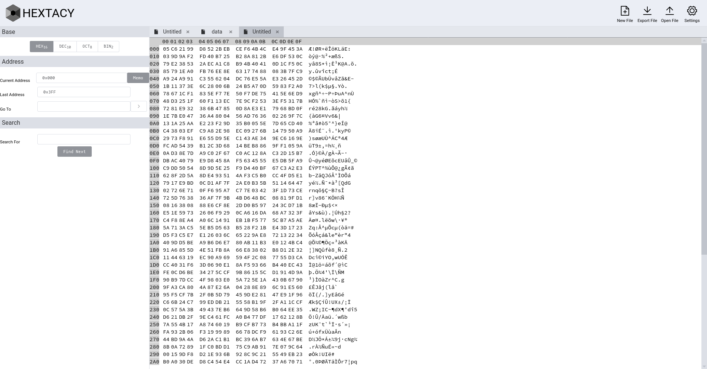

# Hextacy

## Description
This is a Hex editor built with javascript (Vue.js), it doesn't need a backend, everything is written to be run in the browser. You can open files, create files, export files after editing.

**NOTE: this is a work in progress PR's are welcome**

## Project setup
Clone the repo:
```
git clone https://github.com/saeedvw/hextacy.git
cd hextacy
```
Install Packages
```
npm install
```

### Compile for development
```
npm run serve
```

### Compile and minifie for production
```
npm run build
```

### License
Licensed under the GPLv3: http://www.gnu.org/licenses/gpl-3.0.html
